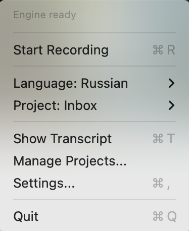
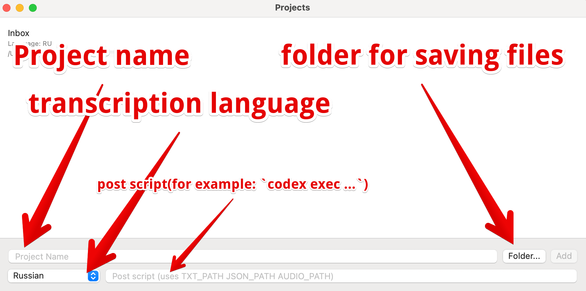

# MacRecorder

> **Important:** Installation can take a while because the installer downloads **two ASR models** upfront (Russian + English) so transcription is ready to use after setup.

MacRecorder is a macOS menu bar app that records microphone + system audio and generates transcripts with a local ASR engine.

## Screenshots




## What This Project Does

- Supports **two transcription languages**: **Russian** and **English**.
- Lets you create projects in advance with:
  - a destination folder,
  - default language,
  - optional post-transcription script.
- Saves output directly to your project folder (for example, an Obsidian vault folder so files appear there immediately).
- Starts transcription **after you stop recording**.
- Writes:
  - `*.wav` (audio),
  - `*.txt` (plain transcript),
  - `*.json` (structured transcript).

## Stereo Recording and Source Separation

Audio is saved in stereo:

- **Left channel**: your microphone (`mic/speak`)
- **Right channel**: system speakers (`speaker/speak`)

The transcriber processes channels separately and tags segments with source labels. This is useful for summarization and diarization-like workflows.

Example:

```text
[00:00:09] [ru][speaker/speak] Я, конечно, не знаю, что она есть.
[00:00:14] [ru][mic/speak] Okay.
```

## Post Script

Each project can define a post script that runs when transcription is finished.

The script can receive paths to generated files via placeholders (and environment variables):

- `TXT_PATH`
- `JSON_PATH`
- `AUDIO_PATH`

Example use case: run `codex exec` to generate a summary from transcript/audio files.

Example command in project settings:

```bash
codex exec "Summarize the conversation from TXT_PATH and provide action items."
```

## Architecture

- `MacRecorder/`: SwiftUI menu bar application
- `engine/`: Python transcription engine (`onnx-asr` based)
- Communication: JSON over stdin/stdout between Swift app and Python engine

## Run Locally

Requirements:

- macOS 14+
- Swift 5.9+
- Python 3

Build and run:

```bash
make build
make run
```

Run Python engine tests:

```bash
make test
```

## Build Installer

```bash
make installer
```

Output package:

- `dist/MacRecorder-0.2.0.pkg`
